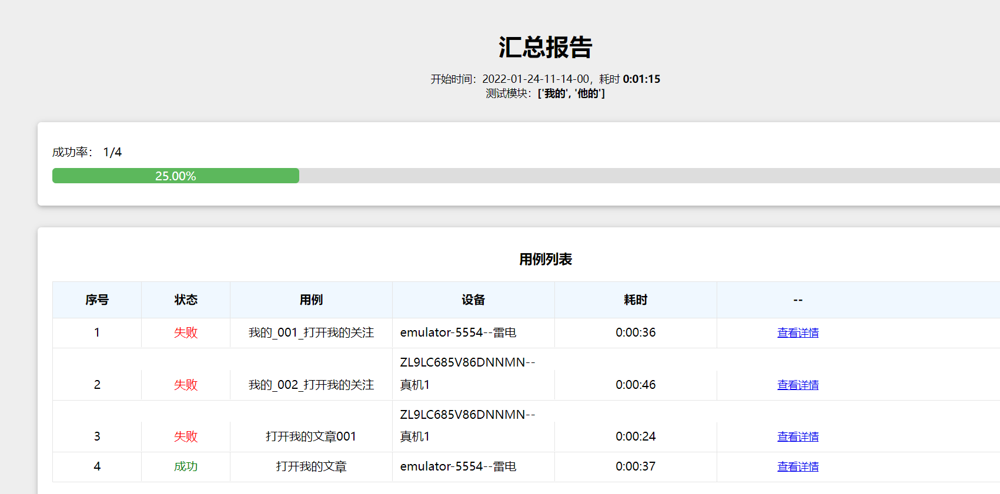
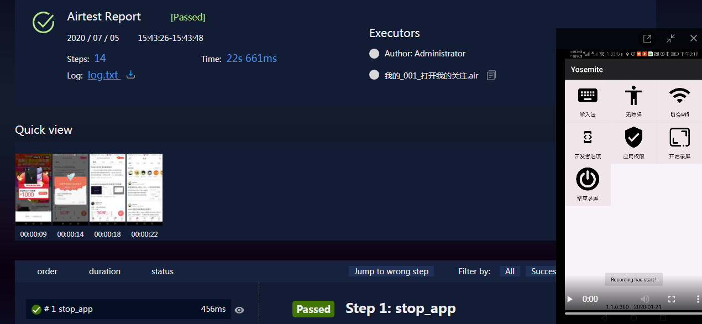

#  概述
- 用airtest做移动端自动化,基于[这里](https://github.com/Louis-me/airtest_auto)的升级版本
- 支持安卓 已经适配,支持多机并行支持yml的关键字驱动
- ios 没有适配
- airtest-selenium 已经适配单机版本，但是记录测试报告对用例错误的显示有问题,还有多机并行时用例非常不稳定,因此建议不用airtest-selenium来做web自动化，
  可以直接用selenium,或者playwright
- 支持host部署报告，比如局域网中给其他人在线看报告。需要改部分report的源码
## 开始运行
- 编写配置文件在config目录下,分别有android、ios、web、setting
- 运行runner.py

## 测试报告

 
   
## 其他
[查看我的changelog](changelog.MD)
